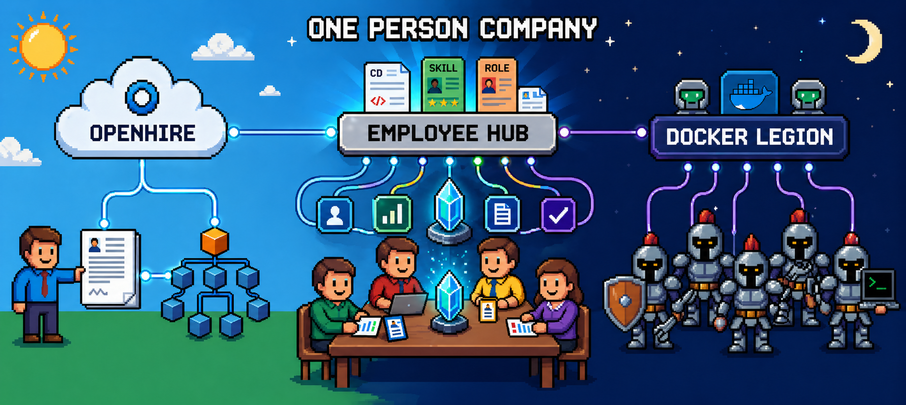
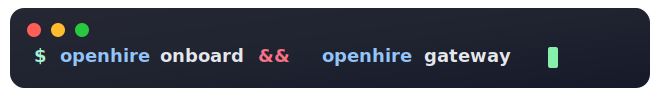
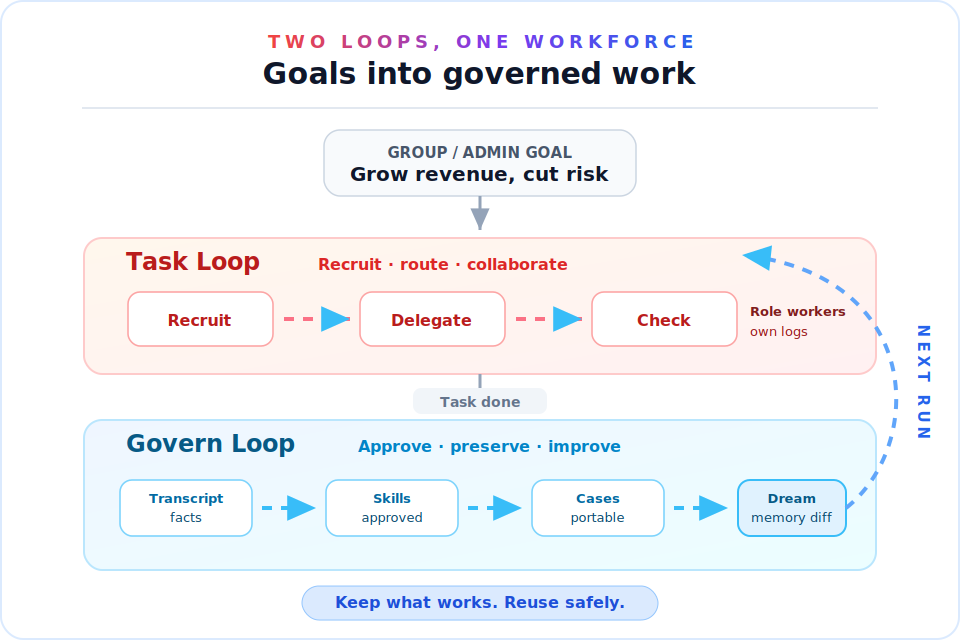
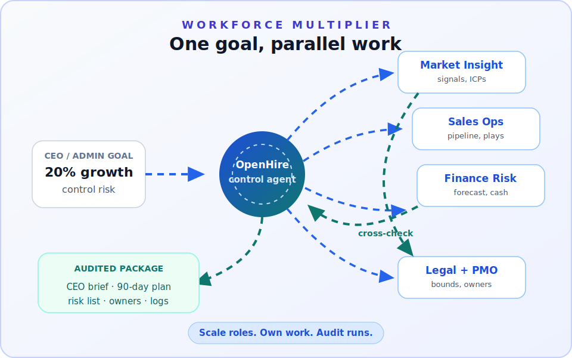
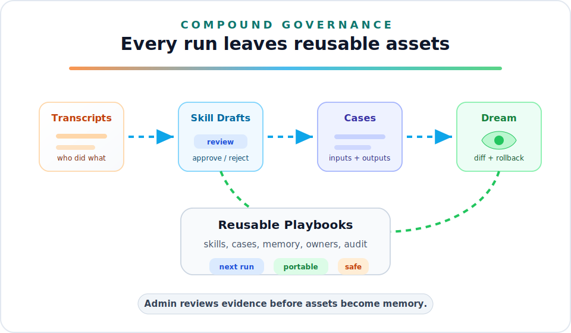
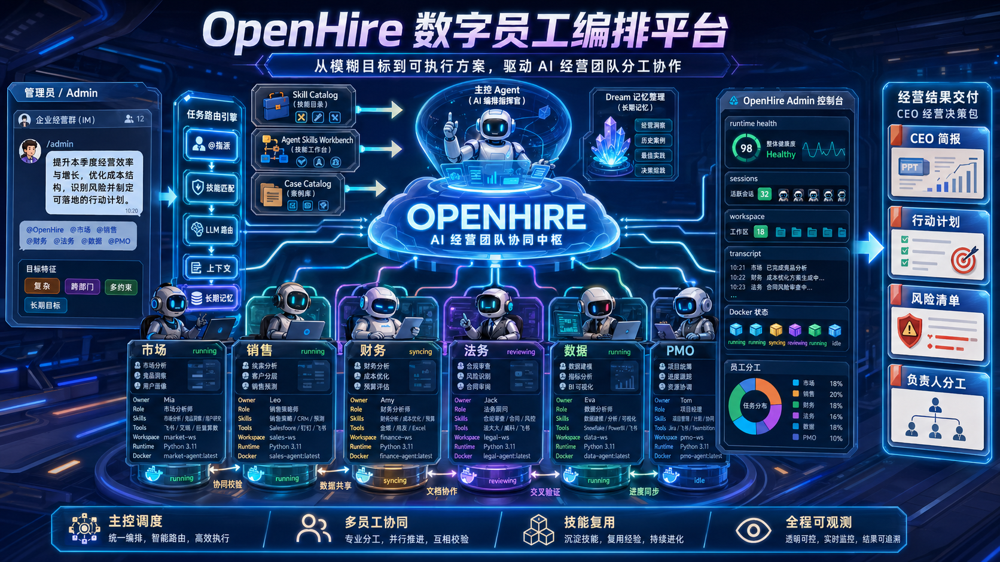
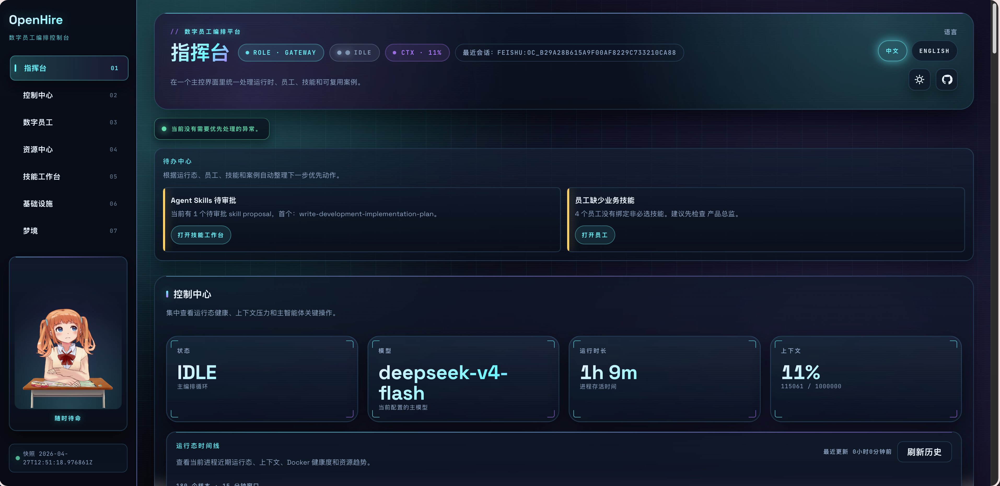
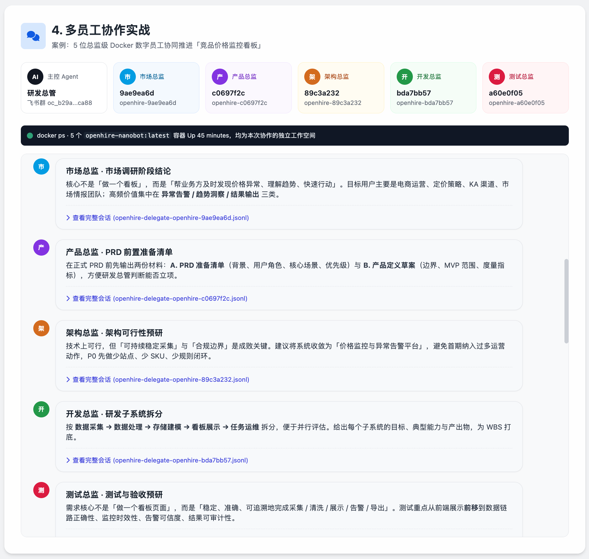

<div align="center">



# OpenHire

<h3>Recruit AI digital employees. Orchestrate them as a governed team.</h3>

One control agent, many role-based workers, reusable skills, case packages, long-term memory, IM channels, and Admin observability.

[](https://www.python.org/)
[](./LICENSE)
[](https://askor305-openhire.ms.show/admin)
[](#admin-and-api)
[](#docker-adapter)
[](#openai-compatible-api)
[](#key-capabilities)
[](#governance-that-compounds)

<br>



[Live demo](https://askor305-openhire.ms.show/admin) · [Visual story](#from-goal-to-governed-workforce) · [Quick start](#quick-start) · [Key capabilities](#key-capabilities) · [Admin and API](#admin-and-api) · [Docker Adapter](#docker-adapter) · [简体中文](README_CN.md)

</div>

<br>

| Recruit employees | Orchestrate work | Govern assets | Reuse outcomes |
|:-:|:-:|:-:|:-:|
| Create role-specific digital employees with owner, tools, skills, workspace, and runtime state. | Route one fuzzy goal to multiple workers through CLI, IM, Gateway, or OpenAI-compatible API. | Review transcripts, skills, cases, Dream memory, and infrastructure from one Admin surface. | Turn successful runs into reusable skills, case packages, employee playbooks, and memory. |

---

## From goal to governed workforce

OpenHire is a **Digital Employee Orchestration Platform**. It is not a thin chatbot shell, a prompt pile, or “drop an agent in a group chat and hope.” It wires roles, tools, skills, memory, containerized workers, reusable cases, and Admin review into one runtime surface.

As long as an agent can be packaged as a Docker image, it can plug into OpenHire’s worker lifecycle, permissions, workspace, and observability. `openclaw`, `hermes`, and `nanobot` are supported today.

<div align="center">



</div>

The task-time loop creates and coordinates digital employees while work is happening. The governance loop keeps the transcript, turns useful behavior into skills and cases, consolidates Dream memory, and makes the next run stronger.

## One goal, many employees

```text
CEO/Admin  > Drops a business goal in the group or /admin:
              "Grow revenue 20% next quarter, keep collection risk in check, and prep the CEO review deck."

OpenHire   > Spawns 6 digital employees:
              market insight, sales ops, finance and risk, legal and compliance, data analytics, program PMO.

Control    > Fans out in parallel:
              market studies signals and competitors; sales maps pipeline and conversion plays;
              finance tests revenue, margin, cash, and collection risk; legal marks red lines.

Collab     > Employees exchange assumptions, cross-check risks, and converge on priorities.

Admin      > The console shows who did what, which skills ran, workspace state, transcripts,
              and the final CEO brief, 30/60/90 plan, risk list, and owners.
```

<div align="center">



</div>

This is not “open more chat windows.” The control agent steers a governed fleet of digital employees that reason together like a leadership team, cross-check each other, and turn fuzzy goals into executable decision packages.

## Governance that compounds

OpenHire preserves the work product, not just the final answer. Transcripts, workspace files, skills, reusable cases, and Dream memory are visible for review and reuse.

<div align="center">



</div>

## Product evidence

The diagrams above explain the operating model. The screenshots below show the current product surface.

<div align="center">



<br><br>



<br><br>



</div>

The Feishu screenshot is from a real group run: the control agent orchestrated market, product, architecture, dev, and test directors at once. Each employee ran in its own `openhire-nanobot` container and workspace, delivering market research, a PRD pre-checklist, architecture feasibility, subsystem breakdown, and test and acceptance pre-work with auditable session logs.

More detail: [assets/report_en.html](assets/report_en.html).

## Key capabilities

In one line: OpenHire is not one agent playing “the whole company.” It is a set of **governed** digital employees that actually collaborate.

- **Control agent**: Talk to OpenHire via CLI, Gateway, or an OpenAI-compatible API.
- **Digital employees**: One employee per role, with owner, role, tools, skills, workspace, and runtime state.
- **Docker Adapter**: Dispatch work to containerized workers for any image-packaged agent; `openclaw`, `hermes`, and `nanobot` are supported.
- **Admin console**: At `/admin`, inspect runtime, sessions, employees, skills, cases, Dream, and infrastructure.
- **Skill Catalog**: Import and manage local skill metadata from ClawHub, SoulBanner, Mbti/Sbti, local files, and web sources.
- **Agent Skills Workbench**: Manage discoverable, readable, reusable workspace skills and approve auto-generated skill proposals.
- **Case Catalog**: Reusable case packages with full inputs, outputs, employees, skills, and import config.
- **Dream**: Consolidate long-term memory for the control agent and digital employees, with diffs and safe rollback.
- **Many channels**: Feishu, Telegram, Discord, Slack, WeChat, WeCom, QQ, DingTalk, WhatsApp, Matrix, Email, WebSocket, and more.
- **Many providers**: Anthropic, OpenAI, OpenAI Codex, GitHub Copilot, DeepSeek, Gemini, OpenRouter, DashScope, Moonshot, Ollama, vLLM, or any OpenAI-compatible endpoint.

## Quick start

### Requirements

- Python 3.11+
- Docker (only if you use the Docker Adapter / digital-employee containers)
- Node.js 18+ (only for bridge channels such as WhatsApp)

### Dev install

```bash
git clone <repo-url>
cd OpenHire

python -m venv .venv
source .venv/bin/activate
python -m pip install -e .
```

Install any extra runtime deps for the features you use. CI runs tests on Python 3.11, 3.12, and 3.13.

### First-time config

```bash
openhire onboard
```

Default config: `~/.openhire/config.json`, default workspace: `~/.openhire/workspace`. You can also use a dedicated instance:

```bash
openhire onboard --config ./config.json --workspace ./workspace
```

### Chat from the CLI

```bash
openhire agent -m "Summarize the main modules in this project"
```

Omit `-m` for interactive mode:

```bash
openhire agent
```

### Gateway and Admin

```bash
openhire gateway
```

By default the Gateway listens on `127.0.0.1:18790`. Then open:

```text
http://127.0.0.1:18790/admin
```

### OpenAI-compatible API

```bash
openhire serve
```

Default API base:

```text
http://127.0.0.1:8900/v1/chat/completions
```

Example request:

```bash
curl http://127.0.0.1:8900/v1/chat/completions \
  -H "Content-Type: application/json" \
  -d '{
    "model": "openhire",
    "messages": [
      {"role": "user", "content": "Hello OpenHire"}
    ]
  }'
```

## Common commands

```bash
openhire --help
openhire status
openhire onboard --help
openhire agent --help
openhire gateway --help
openhire serve --help
openhire channels status
openhire channels login weixin
openhire plugins list
openhire provider login openai-codex
openhire provider login github-copilot
```

## Sample configuration

OpenHire uses a Pydantic schema; JSON may use camelCase or snake_case. A typical slice:

```json
{
  "agents": {
    "defaults": {
      "workspace": "~/.openhire/workspace",
      "model": "anthropic/claude-opus-4-5",
      "provider": "auto",
      "timezone": "Asia/Shanghai",
      "maxToolIterations": 200
    }
  },
  "providers": {
    "anthropic": {
      "apiKey": "${ANTHROPIC_API_KEY}"
    },
    "deepseek": {
      "apiKey": "${DEEPSEEK_API_KEY}",
      "apiBase": "https://api.deepseek.com"
    }
  },
  "gateway": {
    "host": "127.0.0.1",
    "port": 18790
  },
  "api": {
    "host": "127.0.0.1",
    "port": 8900,
    "timeout": 120
  },
  "openhire": {
    "enabled": true,
    "autoRoute": true,
    "autoSelectSkills": true
  },
  "tools": {
    "dockerAgents": {
      "enabled": true,
      "agents": {
        "openclaw": {
          "persistent": true,
          "image": "openhire-openclaw:latest",
          "env": {
            "ANTHROPIC_API_KEY": "${ANTHROPIC_API_KEY}"
          },
          "acp": {
            "defaultAgent": "claude",
            "allowedAgents": ["claude", "codex", "opencode"]
          }
        },
        "nanobot": {
          "persistent": true,
          "image": "openhire-nanobot:latest"
        },
        "hermes": {
          "persistent": true,
          "image": "openhire-hermes:latest"
        }
      }
    }
  }
}
```

`provider: "auto"` picks a provider from the model name, provider keys, local endpoints, or gateway settings. OAuth-style providers are logged in via CLI; you do not need API keys in the file for those.

## Main modules

| Module | Path | Description |
|--------|------|-------------|
| CLI | `openhire/cli/commands.py` | `onboard`, `agent`, `gateway`, `serve`, channel/plugin/provider |
| Agent Loop | `openhire/agent/loop.py` | Control agent, tools, memory, sessions, cron, Dream |
| API / Admin | `openhire/api/server.py` | OpenAI-compatible API, Admin UI, Admin API |
| Workforce | `openhire/workforce/` | Digital-employee registry, lifecycle, routing, workspace, required skills |
| Docker Adapter | `openhire/adapters/` | Container worker registry, lifecycle, `docker_agent` tool |
| Skill Catalog | `openhire/skill_catalog.py` | Local skill metadata, remote search, import preview, content |
| Agent Skills | `openhire/agent_skill_service.py` | Workspace skills, proposals, validation, packaging |
| Case Catalog | `openhire/case_catalog.py` | Reusable case packages: browse, preview, import, export |
| Channels | `openhire/channels/` | IM, Email, WebSocket, and other channel implementations |
| Providers | `openhire/providers/` | LLM provider registry and backends |

More design notes live under `docs/`:

- `docs/01-架构总览.md`
- `docs/02-Docker-Adapter框架.md`
- `docs/03-数字员工管理.md`

## Admin and API

The Admin home brings runtime, inbox, control center, and digital-employee panels into one observable, governable workbench.

With `openhire gateway`, `/admin` is mounted. Today’s Admin areas include:

- **Command Center / Control Center**: runtime health, context pressure, action center, session cockpit.
- **Digital Employees**: create, view, remove employees; manage runtime config, cron, transcripts, workspace.
- **Resource Hub**: cases, personas, skill catalog, import preview, governance.
- **Agent Skills Workbench**: create, edit, delete, package workspace skills; approve auto proposals.
- **Infrastructure**: Docker daemon, container status, provenance, resources.
- **Dream**: control and employee memory files, history, Dream commits, diffs, restore.

Handy API surface:

| Method | Path | Description |
|--------|------|-------------|
| `POST` | `/v1/chat/completions` | OpenAI-compatible chat completion |
| `GET` | `/admin/api/runtime` | Admin runtime snapshot |
| `GET` | `/admin/api/runtime/history` | Runtime timeline history |
| `GET` | `/employees` | List digital employees |
| `POST` | `/employees` | Create a digital employee |
| `DELETE` | `/employees/{id}` | Delete a digital employee |
| `GET` | `/skills` | List local skill catalog |
| `POST` | `/skills/import` | Import skill metadata or content |
| `POST` | `/admin/api/employee-skills/recommend` | Recommend and optionally auto-import skills when creating an employee |
| `GET` | `/admin/api/cases` | List reusable cases |
| `POST` | `/admin/api/cases/{id}/import` | Import built-in or workspace case |
| `GET` | `/admin/api/agent-skills` | List workspace agent skills |
| `GET` | `/admin/api/dream` | List Dream subjects and status |

## Data locations

Default workspace: `~/.openhire/workspace`. Common paths:

| Data | Default path |
|------|----------------|
| Digital-employee registry | `workspace/openhire/agents.json` |
| Local skill catalog | `workspace/openhire/skills.json` |
| Reusable case catalog | `workspace/openhire/cases.json` |
| Per-employee workspace | `workspace/openhire/employees/{employee_id}/workspace` |
| Cron jobs | `workspace/cron/jobs.json` |
| Control-agent memory | `SOUL.md`, `USER.md`, `memory/MEMORY.md`, `memory/history.jsonl` |

## Docker Adapter

The Docker Adapter lets the control agent call external workers through the `docker_agent` tool. It targets any agent shipped as a Docker image with a task entrypoint: you add an image, runtime flags, and adapter command to join OpenHire’s container lifecycle, workspace mounts, and Admin view. Currently:

| Agent | Image | Notes |
|-------|--------|--------|
| `openclaw` | `openhire-openclaw:latest` | ACP to schedule Claude Code, Codex, OpenCode, and other coding agents |
| `hermes` | `openhire-hermes:latest` | Hermes agent worker |
| `nanobot` | `openhire-nanobot:latest` | Lightweight general-purpose worker |

Persistent mode reuses long-lived containers and sends work via `docker exec`; ephemeral mode runs `docker run --rm` per task. Workspace is usually mounted at `/workspace` in the container.

## Development and tests

```bash
python -m openhire --help
python -m openhire onboard --help
python -m openhire gateway --help
python -m openhire serve --help
python -m pytest tests/
```

CI runs on Python 3.11, 3.12, and 3.13 with pytest. Some channel or Docker tests need the right SDK, a Docker daemon, or a local environment.

## License

MIT. See `LICENSE`.
