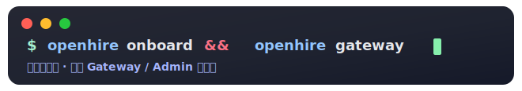
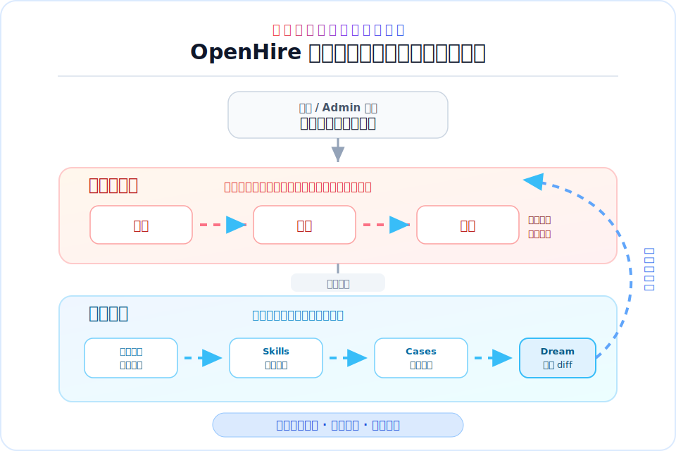
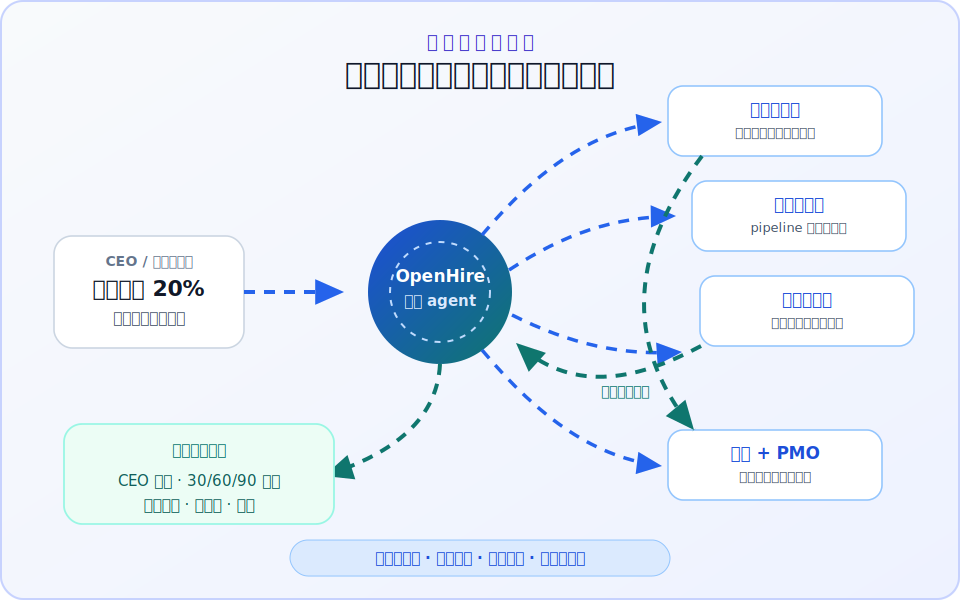
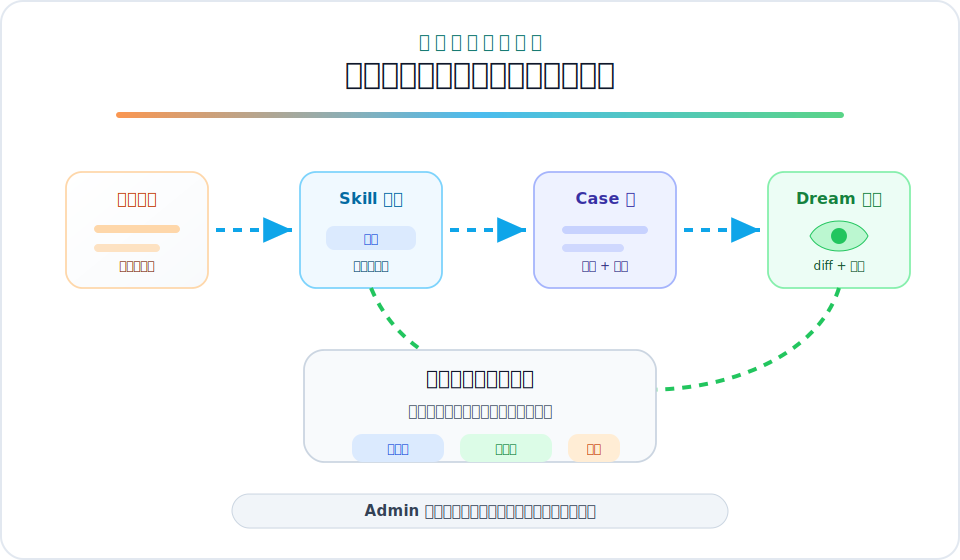

<div align="center">


# OpenHire

<h3>招募 AI 数字员工，把他们编排成一支可治理的团队。</h3>

一个主控 agent，多位角色化 worker，可复用 skills、case packages、长期记忆、IM 渠道和 Admin 可观测面。

[](https://www.python.org/)
[](./LICENSE)
[](https://askor305-openhire.ms.show/admin)
[](#admin-与-api)
[](#docker-adapter)
[](#启动-openai-compatible-api)
[](#核心能力)
[](#治理沉淀)

<br>



[在线演示](https://askor305-openhire.ms.show/admin) · [视觉故事](#从目标到可治理的数字员工团队) · [快速开始](#快速开始) · [核心能力](#核心能力) · [Admin 与 API](#admin-与-api) · [Docker Adapter](#docker-adapter) · [English](README.md)

</div>

<br>

| 招募数字员工 | 编排协作 | 治理资产 | 复用成果 |
|:-:|:-:|:-:|:-:|
| 为不同角色创建数字员工，绑定 owner、tools、skills、workspace 和运行状态。 | 通过 CLI、IM、Gateway 或 OpenAI-compatible API，把一个模糊目标路由给多位 worker。 | 在一个 Admin 面里查看 transcript、skills、cases、Dream memory 和基础设施状态。 | 把成功跑法沉淀成可复用 skills、case packages、员工 playbooks 和长期记忆。 |

---

## 从目标到可治理的数字员工团队

OpenHire 是一个**数字员工编排平台**（Digital Employee Orchestration Platform）。它不是 chatbot 壳子，不是 prompt 拼盘，也不是把 agent 扔进群里自生自灭。OpenHire 把角色、工具、技能、记忆、容器 worker、可复用案例和 Admin 审核接到同一个运行面里。

只要一个 agent 能封装成 Docker 镜像，就可以接入 OpenHire 的 worker 生命周期、权限、workspace 和可观测面；现已支持 `openclaw`、`hermes`、`nanobot`。

<div align="center">



</div>

任务期循环负责在工作发生时创建、路由和协同数字员工；治理循环保留 transcript，把有价值的过程沉淀成 skills 和 cases，整理 Dream memory，并让下一次运行更强。

## 一个目标，多位员工

```text
CEO/管理员 > 在群聊或 /admin 抛出经营目标：
              “下季度营收增长 20%，同时控制回款风险，并准备 CEO 经营会方案。”

OpenHire   > 拉起 6 位数字员工：
              市场洞察官、销售运营官、财务风控官、法务合规官、数据分析官、经营 PMO。

主控 agent > 并行分派：
              市场拆行业信号、竞品打法和客户画像；销售整理机会池和转化动作；
              财务测算收入、毛利、现金流和回款风险；法务提前标出合规红线。

协作过程   > 员工之间交换假设、交叉校验风险，并把冲突收敛成优先级。

Admin      > 前端管理面展示谁做了什么、用了哪些 skills、workspace 状态、session transcript，
              最后收敛成 CEO 简报、30/60/90 天行动计划、风险清单和负责人分工。
```

<div align="center">



</div>

这不是多开几个聊天窗口，而是让主控 agent 指挥一批可治理的数字员工，像一个经营团队一样协同推演、互相校验，并把模糊目标推进成可执行决策包。

## 治理沉淀

OpenHire 保留的不只是最终回答，而是可复盘、可审批、可复用的工作资产。Transcript、workspace 文件、skills、reusable cases 和 Dream memory 都能进入 review 和复用链路。

<div align="center">



</div>

## 真实产品界面

上面的 SVG 展示的是运行模型，下面是当前产品界面和真实协作样例。

<div align="center">


<br><br>


<br><br>


</div>

飞书截图来自一次真实跑通的群协作：主控 agent 同时编排市场、产品、架构、开发、测试 5 位总监级数字员工，每位员工跑在独立的 `openhire-nanobot` 容器和工作空间里，分别交付市场调研结论、PRD 前置清单、架构可行性预研、研发子系统拆分、测试与验收预研，并产出可追溯的完整会话日志。

详细介绍见 [assets/report.html](assets/report.html)。

## 核心能力

一句话：OpenHire 不是让一个 agent 装成一个公司，而是让一组可治理的数字员工真的开始协作。

- **主控 agent**：通过 CLI、Gateway 或 OpenAI-compatible API 与 OpenHire 交互。
- **数字员工**：为不同角色创建独立员工，绑定 owner、role、tools、skills、workspace 和运行状态。
- **Docker Adapter**：把任务分发给容器化 worker，面向所有可镜像化的 agent；现已支持 `openclaw`、`hermes`、`nanobot`。
- **Admin 控制台**：在 `/admin` 查看 runtime、sessions、employees、skills、cases、Dream 和基础设施状态。
- **Skill Catalog**：导入和管理本地 skill 元数据，支持 ClawHub、SoulBanner、Mbti/Sbti、本地文件和网页来源。
- **Agent Skills Workbench**：管理 agent 真正可发现、可读取、可复用的 workspace skills，并审批自动生成的 skill proposals。
- **Case Catalog**：用可复用 case package 保存完整输入、输出、员工、技能和导入配置。
- **Dream 记忆整理**：对主控和数字员工的长期记忆执行 Dream consolidation，并支持查看 diff 与安全回滚。
- **多渠道接入**：内置 Feishu、Telegram、Discord、Slack、WeChat、WeCom、QQ、DingTalk、WhatsApp、Matrix、Email、WebSocket 等 channel 模块。
- **多 provider**：支持 Anthropic、OpenAI、OpenAI Codex、GitHub Copilot、DeepSeek、Gemini、OpenRouter、DashScope、Moonshot、Ollama、vLLM 等 provider 或 OpenAI-compatible endpoint。

## 快速开始

### 环境要求

- Python 3.11+
- Docker（仅在使用 Docker Adapter / 数字员工容器时需要）
- Node.js 18+（仅在使用 WhatsApp 等 bridge channel 时需要）

### 安装开发环境

```bash
git clone <repo-url>
cd OpenHire

python -m venv .venv
source .venv/bin/activate
python -m pip install -e .
```

如果本地还没有运行依赖，请按实际使用模块安装缺失包；CI 使用 Python 3.11、3.12、3.13 运行测试。

### 初始化配置

```bash
openhire onboard
```

默认配置路径为 `~/.openhire/config.json`，默认 workspace 为 `~/.openhire/workspace`。也可以指定独立实例：

```bash
openhire onboard --config ./config.json --workspace ./workspace
```

### 直接对话

```bash
openhire agent -m "总结这个项目的主要模块"
```

不传 `-m` 会进入交互模式：

```bash
openhire agent
```

### 启动 Gateway 和 Admin

```bash
openhire gateway
```

默认 Gateway 监听 `127.0.0.1:18790`。启动后可以打开：

```text
http://127.0.0.1:18790/admin
```

### 启动 OpenAI-compatible API

```bash
openhire serve
```

默认 API endpoint：

```text
http://127.0.0.1:8900/v1/chat/completions
```

示例请求：

```bash
curl http://127.0.0.1:8900/v1/chat/completions \
  -H "Content-Type: application/json" \
  -d '{
    "model": "openhire",
    "messages": [
      {"role": "user", "content": "Hello OpenHire"}
    ]
  }'
```

## 常用命令

```bash
openhire --help
openhire status
openhire onboard --help
openhire agent --help
openhire gateway --help
openhire serve --help
openhire channels status
openhire channels login weixin
openhire plugins list
openhire provider login openai-codex
openhire provider login github-copilot
```

## 配置示例

OpenHire 使用 Pydantic schema，JSON 配置支持 camelCase 与 snake_case。典型配置片段如下：

```json
{
  "agents": {
    "defaults": {
      "workspace": "~/.openhire/workspace",
      "model": "anthropic/claude-opus-4-5",
      "provider": "auto",
      "timezone": "Asia/Shanghai",
      "maxToolIterations": 200
    }
  },
  "providers": {
    "anthropic": {
      "apiKey": "${ANTHROPIC_API_KEY}"
    },
    "deepseek": {
      "apiKey": "${DEEPSEEK_API_KEY}",
      "apiBase": "https://api.deepseek.com"
    }
  },
  "gateway": {
    "host": "127.0.0.1",
    "port": 18790
  },
  "api": {
    "host": "127.0.0.1",
    "port": 8900,
    "timeout": 120
  },
  "openhire": {
    "enabled": true,
    "autoRoute": true,
    "autoSelectSkills": true
  },
  "tools": {
    "dockerAgents": {
      "enabled": true,
      "agents": {
        "openclaw": {
          "persistent": true,
          "image": "openhire-openclaw:latest",
          "env": {
            "ANTHROPIC_API_KEY": "${ANTHROPIC_API_KEY}"
          },
          "acp": {
            "defaultAgent": "claude",
            "allowedAgents": ["claude", "codex", "opencode"]
          }
        },
        "nanobot": {
          "persistent": true,
          "image": "openhire-nanobot:latest"
        },
        "hermes": {
          "persistent": true,
          "image": "openhire-hermes:latest"
        }
      }
    }
  }
}
```

`provider: "auto"` 会根据模型名、provider key、本地 endpoint 或 gateway 配置自动匹配 provider。OAuth 型 provider 使用命令登录，不需要在配置里写 API key。

## 主要模块

| 模块 | 路径 | 说明 |
|------|------|------|
| CLI | `openhire/cli/commands.py` | `onboard`、`agent`、`gateway`、`serve`、channel/plugin/provider 管理 |
| Agent Loop | `openhire/agent/loop.py` | 主控 agent、工具、记忆、session、cron、Dream |
| API / Admin | `openhire/api/server.py` | OpenAI-compatible API、Admin 页面和 Admin API |
| Workforce | `openhire/workforce/` | 数字员工注册、生命周期、路由、workspace、required skill |
| Docker Adapter | `openhire/adapters/` | 容器化 worker registry、生命周期和 `docker_agent` 工具 |
| Skill Catalog | `openhire/skill_catalog.py` | 本地 skill 元数据、远端搜索、导入预览和内容管理 |
| Agent Skills | `openhire/agent_skill_service.py` | Workspace skills、proposal、校验、打包 |
| Case Catalog | `openhire/case_catalog.py` | Reusable case package 的展示、预览、导入和导出 |
| Channels | `openhire/channels/` | IM、Email、WebSocket 等 channel 实现 |
| Providers | `openhire/providers/` | LLM provider registry 与各 provider backend |

更多设计说明见 `docs/`：

- `docs/01-架构总览.md`
- `docs/02-Docker-Adapter框架.md`
- `docs/03-数字员工管理.md`

## Admin 与 API

OpenHire Admin 指挥台首页把运行态、待办、控制中心和数字员工编排面板集中收敛在一个可观测、可治理的工作台里。

`openhire gateway` 启动后会挂载 `/admin`。当前 Admin 覆盖：

- Command Center / Control Center：runtime health、context pressure、action center、session cockpit。
- Digital Employees：创建、查看、删除员工，管理员工 runtime config、cron、transcript 和 workspace。
- Resource Hub：案例、人格、skill catalog、导入预览和治理操作。
- Agent Skills Workbench：创建、编辑、删除、打包 workspace skills，审批自动 proposal。
- Infrastructure：Docker daemon、容器状态、运行来源和资源信息。
- Dream：查看主控与员工记忆文件、history、Dream commits、diff 和 restore。

常用 API：

| 方法 | 路径 | 说明 |
|------|------|------|
| `POST` | `/v1/chat/completions` | OpenAI-compatible chat completion |
| `GET` | `/admin/api/runtime` | Admin runtime snapshot |
| `GET` | `/admin/api/runtime/history` | Runtime timeline 历史 |
| `GET` | `/employees` | 列出数字员工 |
| `POST` | `/employees` | 创建数字员工 |
| `DELETE` | `/employees/{id}` | 删除数字员工 |
| `GET` | `/skills` | 列出本地 skill catalog |
| `POST` | `/skills/import` | 导入 skill 元数据或内容 |
| `POST` | `/admin/api/employee-skills/recommend` | 创建员工时推荐并可自动导入 skills |
| `GET` | `/admin/api/cases` | 列出 reusable cases |
| `POST` | `/admin/api/cases/{id}/import` | 导入内置或 workspace case |
| `GET` | `/admin/api/agent-skills` | 列出 workspace agent skills |
| `GET` | `/admin/api/dream` | 列出 Dream subjects 和状态 |

## 数据路径

默认 workspace 在 `~/.openhire/workspace`。常见文件：

| 数据 | 默认路径 |
|------|----------|
| 数字员工 registry | `workspace/openhire/agents.json` |
| 本地 skill catalog | `workspace/openhire/skills.json` |
| 可复用 case catalog | `workspace/openhire/cases.json` |
| 员工 workspace | `workspace/openhire/employees/{employee_id}/workspace` |
| Cron jobs | `workspace/cron/jobs.json` |
| 主控记忆 | `SOUL.md`、`USER.md`、`memory/MEMORY.md`、`memory/history.jsonl` |

## Docker Adapter

Docker Adapter 让主控 agent 通过 `docker_agent` 工具调用外部 worker。它面向所有能以 Docker 镜像交付、并能暴露任务执行入口的 agent：新增 agent 只需要提供镜像、运行参数和 adapter command，就能纳入 OpenHire 的容器生命周期、workspace 挂载和 Admin 观测。当前已支持：

| Agent | 镜像 | 说明 |
|-------|------|------|
| `openclaw` | `openhire-openclaw:latest` | 通过 ACP 调度 Claude Code、Codex、OpenCode 等 coding agents |
| `hermes` | `openhire-hermes:latest` | Hermes agent worker |
| `nanobot` | `openhire-nanobot:latest` | 轻量通用 worker |

持久化模式会复用常驻容器，通过 `docker exec` 发送任务；临时模式会为单次任务运行 `docker run --rm`。容器内 workspace 默认挂载到 `/workspace`。

## 开发与验证

常用验证命令：

```bash
python -m openhire --help
python -m openhire onboard --help
python -m openhire gateway --help
python -m openhire serve --help
python -m pytest tests/
```

CI 当前覆盖 Python 3.11、3.12、3.13，并运行 pytest。部分 channel 或 Docker 相关测试依赖对应 SDK、Docker daemon 或本地运行环境。

## License

MIT. See `LICENSE`.
